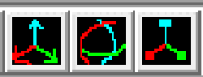

# WOFFC Editor
A C++ winAPI tool using the DirectX Tool Kit and SQLite for basic level editing.

## What is this for?
This project is for my Tools Programming module in my 4th year at university.

## Features
**Usability**
* Camera and navigation system.
* Point and click object selection (multi-object support).
* Wireframe modes.
* Selection highlighting.
* Focus on selected objects.

**World Editing**
* Random terrain generation.
* Object manipulation.
* Creation of new objects.

## Controls
**Navigation Controls**

| Control | Action |
| --- | --- |
| Hold Right Mouse Button + Drag | Rotates the camera. |
| Hold Right Mouse Button + W | Moves the camera forward. |
| Hold Right Mouse Button + A | Moves the camera left. |
| Hold Right Mouse Button + S | Moves the camera back. |
| Hold Right Mouse Button + D | Moves the camera right. |
| Hold Right Mouse Button + E | Moves the camera up. |
| Hold Right Mouse Button + Q | Moves the camera down. |

**Selection Controls**

 

| Control | Action |
| --- | --- |
| Left Mouse Button | Selects the object under the cursor. |
| Double Left Mouse Button | Moves the camera to the selected object. |

**Hotkeys**  
Controls listed here already have button representations, so these controls are considered hotkey versions for quicker access.  

| Control | Action |
| --- | --- |
| 1 | Sets the editor into translate mode. |
| 2 | Sets the editor into rotate mode. |
| 3 | Sets the editor into scale mode. |
| G | Generates some random terrain. |
| P | Spawns a tree at the camera's location. |
| Ctrl + W | Toggles wireframe mode. |
| Ctrl + S | Saves the level. |

**Transform Controls**

  

**Translation**  

| Control | Action |
| --- | --- |
| I | Moves the object(s) forward. |
| J | Moves the object(s) left. |
| K | Moves the object(s) back. |
| L | Moves the object(s) right. |
| O | Moves the object(s) up. |
| U | Moves the object(s) down. |  
  
**Rotation**  

| Control | Action |
| --- | --- |
| I | Rotates pitch of object(s). |
| J | Rotates yaw of object(s). |
| K | Rotates pitch of object(s). |
| L | Rotates yaw of object(s). |
| O | Rotates roll of object(s). |
| U | Rotates roll of object(s). |

**Scale**  

| Control | Action |
| --- | --- |
| I | Scales object(s) along the z axis (inward). |
| J | Scales object(s) along the x axis (inward). |
| K | Scales object(s) along the z axis (outward). |
| L | Scales object(s) along the x axis (outward). |
| O | Scales object(s) along the y axis (outward). |
| U | Scales object(s) along the y axis (inward). |

## Authors
Jason Mottershead - Level Editing Functionality  
Matthew Bett - Base Framework with DirectX Tool Kit
